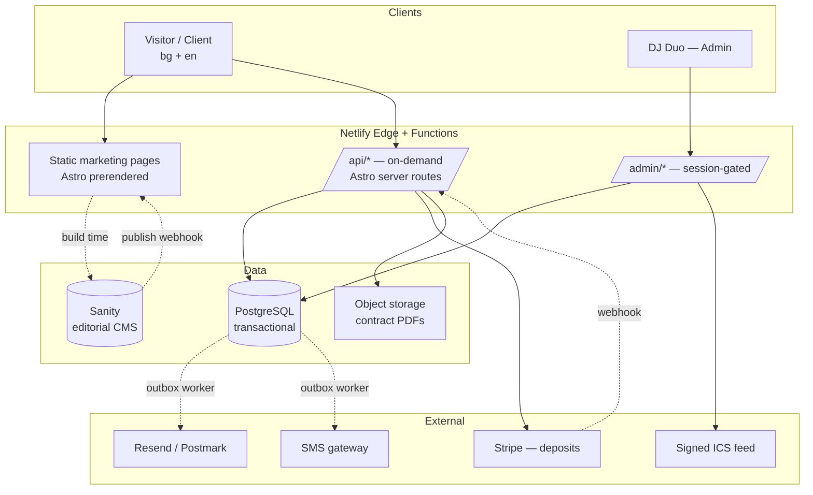
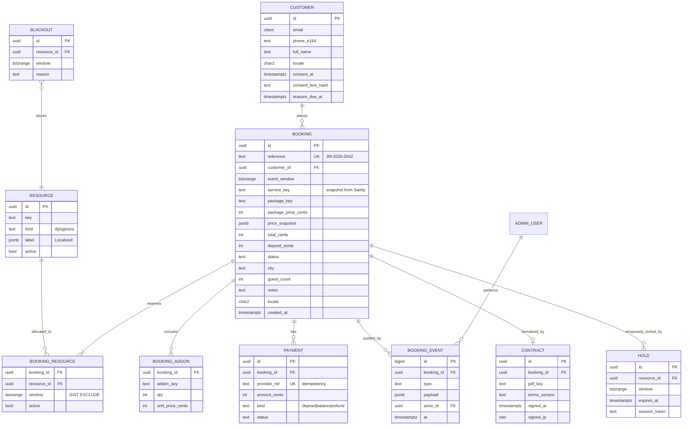
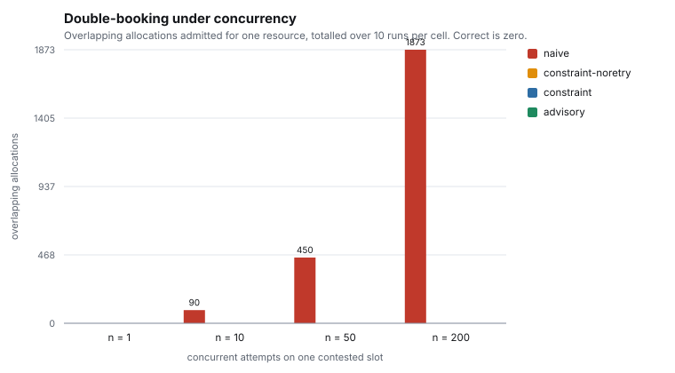
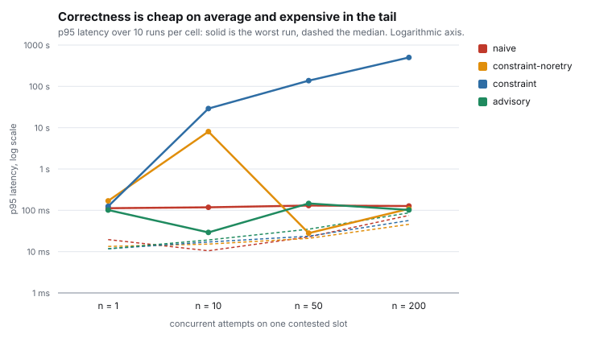
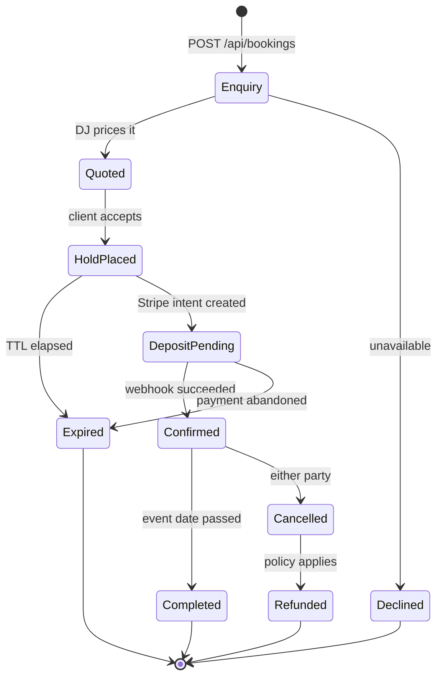

# Diploma Project Plan — Booking & Availability System

**Title (BG):** Проектиране и реализация на уеб система за онлайн резервации
с гарантирана консистентност при конкурентен достъп

**Title (EN):** Design and Implementation of a Web-Based Booking System with
Guaranteed Consistency under Concurrent Access

**Programme:** MSc Software Engineering, Technical University of Sofia
**Base artifact:** `jm-party-team` — bilingual (BG/EN) Astro + Sanity marketing site
**Extension:** transactional booking subsystem with concurrency-safe resource allocation

The title is deliberately broad. It obliges only the exclusion constraint (§5) and one load
experiment (§5.1); everything else in this document is optional scope that can be added or
dropped without revisiting the title.

---

## 1. Problem statement & research question

The existing site is a static brochure. Enquiries go through Netlify Forms into an inbox —
there is no persistence, no availability check, no confirmation, and nothing stops two clients
from being promised the same Saturday in June.

> **Research question.** How can a serverless, statically-generated web application guarantee
> correctness of resource allocation (absence of double-booking) under concurrent load, while
> keeping slowly-changing editorial content and fast-changing transactional state in separate,
> purpose-appropriate data stores?

Two measurable sub-problems follow:

1. **Concurrency control.** Compare naive, optimistic (`SERIALIZABLE` + retry) and declarative
   (PostgreSQL GiST exclusion constraint) strategies for preventing overlapping allocations.
2. **Polyglot persistence.** Quantify the cost and benefit of splitting a headless CMS (Sanity)
   from a relational transactional store (PostgreSQL), including the price-immutability problem.

---

## 2. Current state (baseline)

| Aspect | Present |
|---|---|
| Framework | Astro 7, `output: 'static'`, zero client runtime |
| Styling | Tailwind CSS v4, dark-first, WCAG 2.2 AA palette |
| CMS | Sanity 6, `sanity-plugin-internationalized-array`, 9 document types |
| i18n | BG default (unprefixed) + EN at `/en/`, localized URL segments, hreflang |
| Content layer | GROQ query flattened into typed `Localized<T>` structures |
| Fallback | `src/content/placeholder.ts`, build-time launch gate (`REQUIRE_REAL_CONTENT`) |
| SEO | JSON-LD `LocalBusiness`, sitemap, canonical, robots |
| Deployment | Netlify, CSP + security headers, publish-webhook rebuild |
| Booking | Netlify Forms only — **no state, no availability, no payment** |
| Tests | **None** |
| CI | **None** |

Approximate size: ~3.5–4k LOC across `src/`, `studio/`, `scripts/`.

---

## 3. Target architecture

### 3.1 System context



### 3.2 Key architectural decision — the CMS is not the database

Sanity owns editorial content consumed at build time. PostgreSQL owns transactional state with
ACID guarantees. Prices are **snapshotted** from Sanity into the booking record at quote time, so
a later CMS edit can never retroactively alter an agreed price. This is the central design
argument of the thesis and should be defended explicitly (ADR-001).

### 3.3 Rendering topology

`astro.config.mjs` moves from `output: 'static'` to `output: 'server'` with the Netlify adapter.
Every existing marketing page keeps `export const prerender = true`; only `/api/**` and
`/admin/**` render on demand. The performance profile of the public site must be shown to be
unchanged — measured, not asserted.

```js
import netlify from '@astrojs/netlify';

export default defineConfig({
  output: 'server',
  adapter: netlify(),
  // existing i18n + sitemap config unchanged
});
```

---

## 4. Domain model



### 4.1 Modelling notes to justify in writing

- **`price_snapshot jsonb`** — immutability of the quoted price against later CMS edits.
- **`tstzrange` in `Europe/Sofia`** — events cross midnight (18:00 → 03:00). Half-open ranges
  `[start, end)` avoid boundary off-by-one. DST transitions in March/October are a real
  correctness hazard and deserve a dedicated subsection.
- **`resource` table** — models the duo as independently allocatable units, so the system can
  answer "can we accept two events on the same night?". Without it the model is a toy.
- **`booking_event`** — append-only audit log; serves GDPR accountability *and* supplies the
  funnel data for the evaluation chapter.
- **`erasure_due_at`** — automated GDPR Art. 17 retention.
- **Money as integer cents** — never floating point. EUR only, consistent with `src/lib/money.ts`.

---

## 5. Core contribution — double-booking prevention

Correctness is enforced by the database rather than by application code, so it holds no matter
how many processes race for the same date:

```sql
CREATE EXTENSION IF NOT EXISTS btree_gist;

ALTER TABLE booking_resource
  ADD CONSTRAINT no_double_booking
  EXCLUDE USING gist (
    resource_id WITH =,
    slot        WITH &&
  ) WHERE (active);
```

### 5.1 The four strategies compared

| Strategy | Mechanism |
|---|---|
| `naive` | `SELECT` availability, then `INSERT` — the check-then-act pattern |
| `constraint-noretry` | `INSERT` and let the exclusion constraint arbitrate; no retry |
| `constraint` | The same, with bounded retry on deadlock and serialization failure |
| `advisory` | `pg_advisory_xact_lock` on the contended key, then `INSERT` under the constraint |

The advisory strategy was not in the original design. It was added after the measurements
showed that the constraint alone, while always correct, resolves conflicts by way of
PostgreSQL's deadlock detector rather than by refusing the loser.

### 5.2 Experiment 1 — results

Ten runs per cell; *N* concurrent workers all claiming the same slot on the same resource.
Harness: `npm run experiment` (`scripts/experiment-concurrency.ts`), local PostgreSQL 17,
`deadlock_timeout` at its default of one second.

| Strategy | N | Admitted | Overlapping | Errored | Storm runs | p95 median | p95 worst |
|---|---|---|---|---|---|---|---|
| naive | 10 | 10.0 | **90** | 0 | 0/10 | 10 ms | 119 ms |
| naive | 50 | 46.0 | **450** | 0 | 0/10 | 22 ms | 130 ms |
| naive | 200 | 188.3 | **1873** | 0 | 0/10 | 75 ms | 127 ms |
| constraint-noretry | 10 | 1.0 | 0 | 9 | 1/10 | 15 ms | 8.0 s |
| constraint-noretry | 200 | 1.0 | 0 | 0 | 0/10 | 45 ms | 108 ms |
| constraint | 10 | 1.0 | 0 | 9 | 1/10 | 17 ms | 29.1 s |
| constraint | 50 | 1.0 | 0 | 49 | 1/10 | 20 ms | 137.7 s |
| constraint | 200 | 1.0 | 0 | 398 | 2/10 | 50 ms | **501.4 s** |
| advisory | 10 | 1.0 | 0 | 0 | 0/10 | 19 ms | 29 ms |
| advisory | 50 | 1.0 | 0 | 0 | 0/10 | 34 ms | 147 ms |
| advisory | 200 | 1.0 | 0 | 0 | 0/10 | 86 ms | **102 ms** |





### 5.3 Three findings

**The check-then-act pattern fails in proportion to load.** At 200 concurrent attempts the naive
implementation admitted 188 of them on average — 1873 overlapping allocations across ten runs.
It is not merely occasionally wrong; under contention it is almost always wrong, and it is the
*fastest* of the four, which is exactly why it is tempting.

**The exclusion constraint is correct but resolves conflicts through the deadlock detector.**
Two transactions each insert their tuple, then each waits on the other's uncommitted row.
PostgreSQL breaks the cycle by aborting a victim after `deadlock_timeout`. The loser therefore
receives an error (`40P01`) rather than an answer, and pays a full second of waiting to get it.
The behaviour is bimodal: most runs resolve in tens of milliseconds, a minority collapse.

**Retrying a deadlock amplifies it.** Bounded retry raised the worst observed p95 from 8.0 s to
501.4 s, because each attempt re-enters the same collision and pays the detector's timeout
again. Retry is the correct response to a serialization failure and the wrong response to
contention on a single hot key.

The fix is to stop the deadlock from forming: take a transaction-scoped advisory lock on the
contested key before touching the index. Contenders then queue, the winner commits, and the
next attempt fails immediately with a plain constraint violation. Across every concurrency
level this produced zero violations, zero errors, and a worst-case p95 of 102 ms.

The practical conclusion is that correctness and a usable failure mode are separate properties.
The constraint supplies the first; only the lock ordering supplies the second.

### 5.4 A defect surfaced by load

The experiment aborted partway through its second run with a unique-constraint violation on
`booking.reference`. Reference generation used `lpad(counter::text, 4, '0')`, and `lpad`
truncates rather than pads once the input exceeds the target width: booking 10000 was issued
`JM-2026-1000`, colliding with booking 1000. The defect is invisible below 10 000 bookings and
would have reached production. It is fixed in migration `005` and covered by a regression test.

Worth stating plainly in the defence: this was found by running the system under load, not by
the unit tests, and not by reading the code.

### 5.5 Experiment 2 — hold TTL trade-off (not implemented)

A `HOLD` row would reserve the slot while the client completes payment, swept by a scheduled
function on expiry. Varying TTL ∈ {5, 10, 20, 30} minutes would measure conversion against
inventory blocking. Deferred with the payment work; recorded here as future work.

---

## 6. Booking lifecycle



Transitions are table-driven (a single guard map), not scattered conditionals — one place to
test, and it yields a clean UML figure for the thesis.

---

## 7. API surface

```
POST   /api/availability          { date, serviceKey } -> { available, alternatives[] }
POST   /api/quote                 { serviceKey, packageKey, addons[], date, city } -> breakdown
POST   /api/bookings              create enquiry (rate-limited, Turnstile)
GET    /api/bookings/:ref         magic-link token, no account required
POST   /api/bookings/:ref/accept  place HOLD, create Stripe PaymentIntent
POST   /api/webhooks/stripe       signature-verified, idempotent
POST   /api/webhooks/sanity       revalidate prerendered pages

GET    /admin                     calendar + pipeline (session-gated)
PATCH  /api/admin/bookings/:id    status transitions
POST   /api/admin/blackouts       block dates
GET    /api/admin/calendar.ics    signed ICS feed for phone calendars
GET    /api/admin/stats           funnel + revenue metrics
```

All payloads validated with Zod at the boundary; TypeScript types derived from the schemas,
extending the type-safety discipline already present in `src/lib/types.ts`.

---

## 8. Security & compliance

- **Admin authentication** — Lucia or Auth.js, argon2id password hashing, httpOnly +
  `SameSite=Strict` session cookies, TOTP second factor.
- **Authorization** — roles `owner` and `assistant` (read-only), enforced in middleware.
- **Public endpoints** — Cloudflare Turnstile replacing the honeypot, token-bucket rate limiting
  per IP and per phone number, idempotency keys on all POSTs.
- **OWASP Top 10 walkthrough** — parameterised queries, CSRF tokens on admin mutations, CSP
  tightened to nonces (drop `unsafe-inline`), SSRF-safe webhook handling, Stripe signature
  verification.
- **GDPR / ЗЗЛД** — lawful basis per field, versioned consent text with hash, DSAR export
  endpoint, automated erasure job, DPIA summary.
- **PCI scope** — Stripe Elements keeps card data off the server; document the reduction to SAQ-A.

---

## 9. Quality engineering

| Layer | Tool | Target |
|---|---|---|
| Unit | Vitest | `money.ts`, availability solver, state-machine guards, `Localized` flattening |
| Property-based | fast-check | Interval overlap invariants over randomly generated ranges |
| Integration | Vitest + Testcontainers (PostgreSQL) | Constraint behaviour, transaction isolation |
| Contract | MSW | Stripe webhook payload handling |
| E2E | Playwright | Full booking flow in both locales, keyboard-only path |
| Accessibility | axe-core in Playwright | WCAG 2.2 AA regression gate |
| Load | k6 | Concurrency experiments (§5) |
| CI | GitHub Actions | Lint, typecheck, test, Lighthouse CI budgets |

---

## 10. Repository layout

```
src/
  pages/
    api/
      availability.ts
      quote.ts
      bookings/
      webhooks/
    admin/
      index.astro
      bookings/[id].astro
      calendar.astro
  server/
    db/            drizzle schema + SQL migrations
    domain/        state machine, availability solver, pricing
    services/      stripe, notifications, contracts
    auth/          session, rbac, middleware
  lib/             existing — content.ts, money.ts, types.ts, sanity.ts, env.ts
tests/
  unit/ integration/ e2e/ load/
docs/
  adr/             architecture decision records
```

Drizzle is preferred over Prisma: it emits plain SQL migrations (needed for the hand-written
`EXCLUDE` constraint) and suits serverless connection limits when paired with a pooler
(Neon or Supabase pgBouncer).

---

## 11. Evaluation chapter — what gets measured

1. **Correctness** *(Tier 0 — mandatory)* — done; see §5.2. Double-booking rate across four
   strategies and four concurrency levels, with the latency tail that distinguishes them.
2. **Performance** *(Tier 0 — cheap, do it)* — p50/p95/p99 API latency; Core Web Vitals before
   vs. after the static → hybrid migration.
3. **Cost** — €/month at 1k / 10k / 100k monthly visitors; serverless vs. small VPS.
4. **Usability** — SUS questionnaire with 8–12 participants on the booking flow; task completion
   time and error rate.
5. **Business impact** — enquiry → confirmed conversion derived from `booking_event`, compared
   against the Netlify Forms baseline.

Items 1 and 2 come almost free from the k6 run and a pair of Lighthouse reports. Items 3–5
require additional scope and belong to Tier B or later.

---

## 12. Scope tiers

The full plan above is deliberately ambitious. Four defensible cut-off points:

### Tier 0 — One week (selected scope)
The reduced core described in §13. Four tables, the `EXCLUDE` constraint, three endpoints,
minimal admin, the invariant test, and Experiment 1. Sufficient to justify the thesis title.

### Tier A — Minimum comfortable thesis
Tier 0 **plus** the quote endpoint, holds with TTL, an admin calendar view, the full test
pyramid and a CI pipeline. Drops: Stripe, contracts, SMS, ICS, usability study.

### Tier B — Recommended if 3–4 weeks are available
Tier A **plus** the booking state machine, Stripe deposits with idempotent webhooks,
outbox-pattern email notifications, Playwright E2E, Experiment 2, and the SUS usability study.
Best effort-to-defensibility ratio.

### Tier C — Full plan
Everything in this document, including contract PDF generation, ICS feed, SMS, GDPR automation
jobs, and the complete five-part evaluation.

---

## 13. One-week execution plan (Tier 0)

The load experiment is the thesis. Steps 1–5 exist only to make step 6 possible; if time runs
short, degrade the admin panel rather than cutting the measurements.

| Day | Work | Done when |
|---|---|---|
| 1 | Local PostgreSQL, Drizzle setup, 4-table schema: `customer`, `resource`, `booking`, `booking_resource` | `drizzle-kit push` applies cleanly |
| 2 | Hand-written `EXCLUDE` migration; integration test asserting overlapping inserts are rejected | Test goes red without the constraint, green with it |
| 3 | Astro `output: 'server'` + Netlify adapter; `prerender = true` on all existing pages; `/api/availability` and `/api/bookings` with Zod validation | Existing pages still build as static |
| 4 | Rewire `BookingForm.astro` from Netlify Forms to `POST /api/bookings`; single-password session cookie; `/admin` list view | End-to-end booking visible in admin |
| 5 | k6 script: naive path vs. constraint path, at 1/10/50/200 virtual users | Raw result data collected |
| 6 | Analyse results, produce conflict-rate and latency plots | Figures ready for Chapter 7 |
| 7 | Buffer, README, deployment, screenshots | — |

### Explicitly out of scope for Tier 0

Stripe and payments, holds/TTL, notifications (email/SMS), contract PDFs, ICS feed, GDPR
retention jobs, RBAC and 2FA, the optimistic-locking third strategy, Playwright E2E,
property-based tests, and the SUS usability study. All are recorded as future work.

### Reduced schema for Tier 0

From §4, keep only: `customer`, `resource`, `booking` (including `price_snapshot`), and
`booking_resource` (carrying the `tstzrange` and the exclusion constraint). Drop `hold`,
`payment`, `blackout`, `contract`, `booking_event`, and `admin_user`.

### Full build order (if scope later expands)

1. PostgreSQL + Drizzle schema + `EXCLUDE` constraint; integration tests proving the invariant.
2. Availability and quote endpoints; rewire the existing `BookingForm.astro` to `/api/bookings`.
3. State machine + admin authentication + admin calendar view.
4. Stripe deposits with idempotent webhooks + outbox-pattern notifications.
5. Contract PDF generation, ICS feed, GDPR retention jobs.
6. Test suite + CI + load experiments.
7. Write the evaluation chapter from the collected measurements.

---

## 14. Thesis document structure

| Chapter | Content |
|---|---|
| 1. Introduction | Domain, motivation, research question, objectives |
| 2. Analysis | Requirements (functional/non-functional), competitor and technology survey |
| 3. Related work | Booking/reservation systems, concurrency control literature, headless CMS patterns |
| 4. Design | Architecture, domain model, state machine, ADRs and trade-offs |
| 5. Implementation | Stack, key algorithms, security measures, i18n and accessibility |
| 6. Testing | Strategy, coverage, CI pipeline |
| 7. Evaluation | The five measurement sets from §11, with figures |
| 8. Conclusion | Contributions, limitations, future work |
| Appendices | Schema DDL, API reference, SUS questionnaire, load-test scripts |

---

## 15. Open decisions

- Managed PostgreSQL provider — Neon vs. Supabase (connection pooling behaviour differs).
- Whether the admin UI stays in Astro or moves to a small React island for the calendar.
- Whether contracts require a qualified electronic signature under Bulgarian law, or whether
  click-wrap acceptance with an audit trail is sufficient for this use case.
